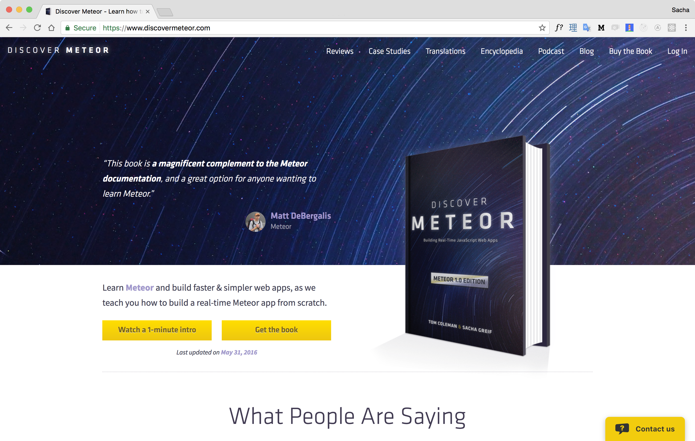
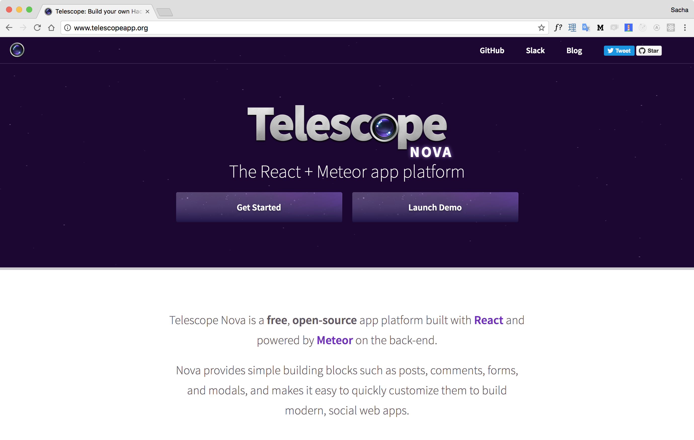
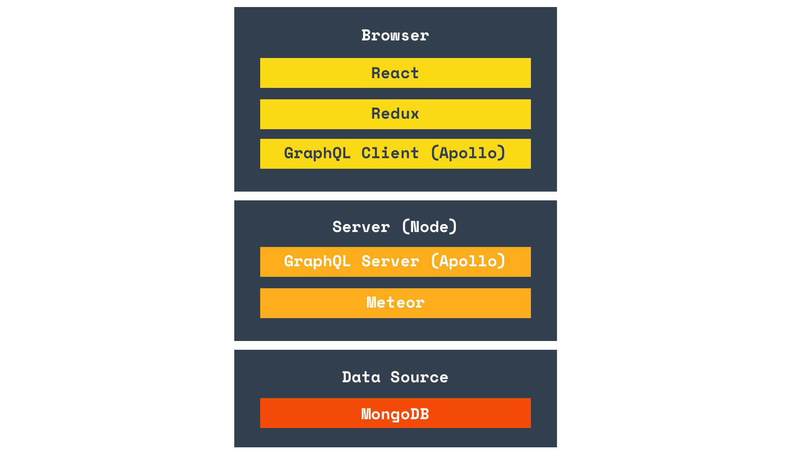

export {vulcan as theme} from './theme';

import { Invert } from 'mdx-deck/layouts';
import { Appear } from 'mdx-deck';
import { Head } from 'mdx-deck';
import { Image } from 'mdx-deck'

<Head>
  <title>Vulcan.js - The full-stack React+GraphQL framework</title>
</Head>

import VideoLoop from './components/VideoLoop.js'
import Logo from './components/Logo.js'

<Logo/>

## VulcanJS

#### The fullstack React+GraphQL framework

7 nov. 2018

Apollinaire Lecocq

---

export default Invert

# The problem

---


---

export default Invert

# The solution

---


---

export default Invert

# Origin story

---

## Meteor


---

## Discover Meteor



---

## Telescope



---

export default Invert

# Enter Vulcan.js

---

## So what's Vulcan.js ?

<ul style={{textAlign: 'left'}}>
<Appear>
  <li>Fullstack</li>
  <li>Opinionated</li>
  <li>Fully customizable</li>
</Appear>
</ul>

---

## The Vulcan.js Stack



---

export default Invert

# Features

---

## User accounts

<VideoLoop videoStyle={{width:'60vw', maxHeight:'50vh'}} src="./assets/accounts.mp4" />

---

## GraphQL schema generation


---

## Simple data loading and updating

```js
const listOptions = {
  collection: Movies,
  fragment: fragment
};

export default withMulti(listOptions)(MoviesList);
```

---

## Automated forms

```jsx
<Components.SmartForm collection={Movies} />
```

```jsx
<Components.SmartForm 
  collection={Movies}
  documentId={this.props.documentId} />
```

Never code a form again!

---

## Permission system

```js
const schema = {
  name: {
    type: String,
    label: 'Name',
    optional: false,
    canRead: ['guests'],
    canCreate: ['members'],
    canUpdate: ['admins', Users.owns]
  }
}
```

---

## Internationalization

<VideoLoop src="./assets/i18n.mp4" videoStyle={{width:'80vw', maxHeight:'50vh'}} />

---


---

import css from './node_modules/react-github-button/assets/style.css'
import GithubButton from 'react-github-button';


# Thanks! 
<div>
  <a style={{color:'#33414F', textDecorationColor: 'none'}} href="http://vulcanjs.org" target="_blank">
    <h3>vulcanjs.org</h3>
  </a>
  <a style={{color:'#33414F', textDecorationColor: 'none'}} href="https://slack.vulcanjs.org" target="_blank">
    <h3>slack.vulcanjs.org</h3>
  </a>
  <a style={{color:'#33414F', textDecorationColor: 'none'}} href="https://github.com/VulcanJS/Vulcan" target="_blank">
    <h3>github.com/VulcanJS/Vulcan</h3>
  </a>
  <div style={{width: '100%',marginLeft:'calc(50% - 65px)'}}> 
    <GithubButton type="stargazers" size="large" namespace="VulcanJS" repo="Vulcan" />
  </div>
</div>
